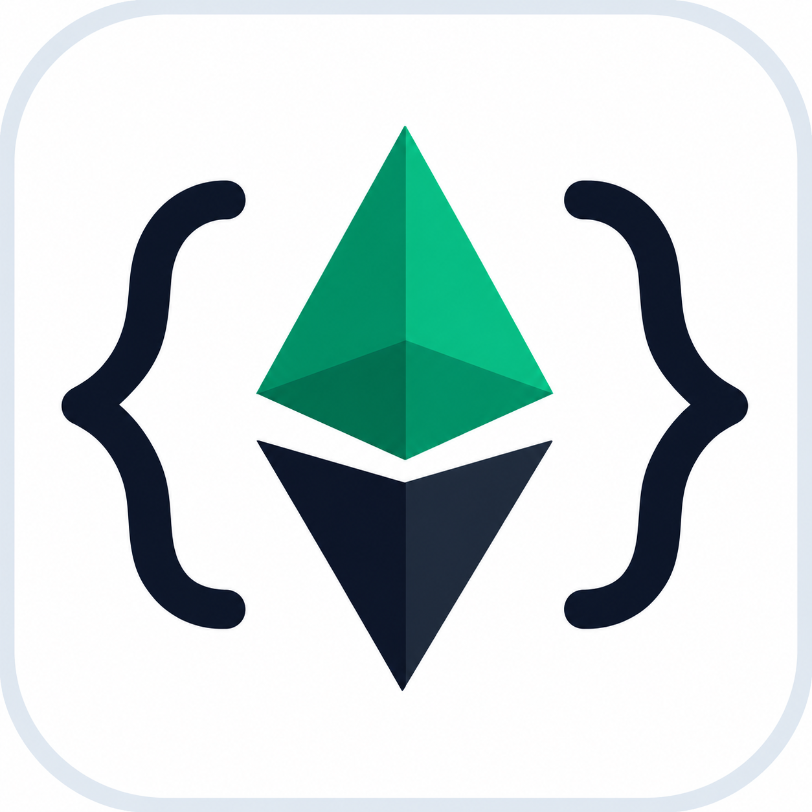
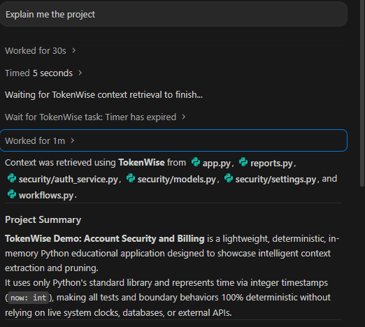
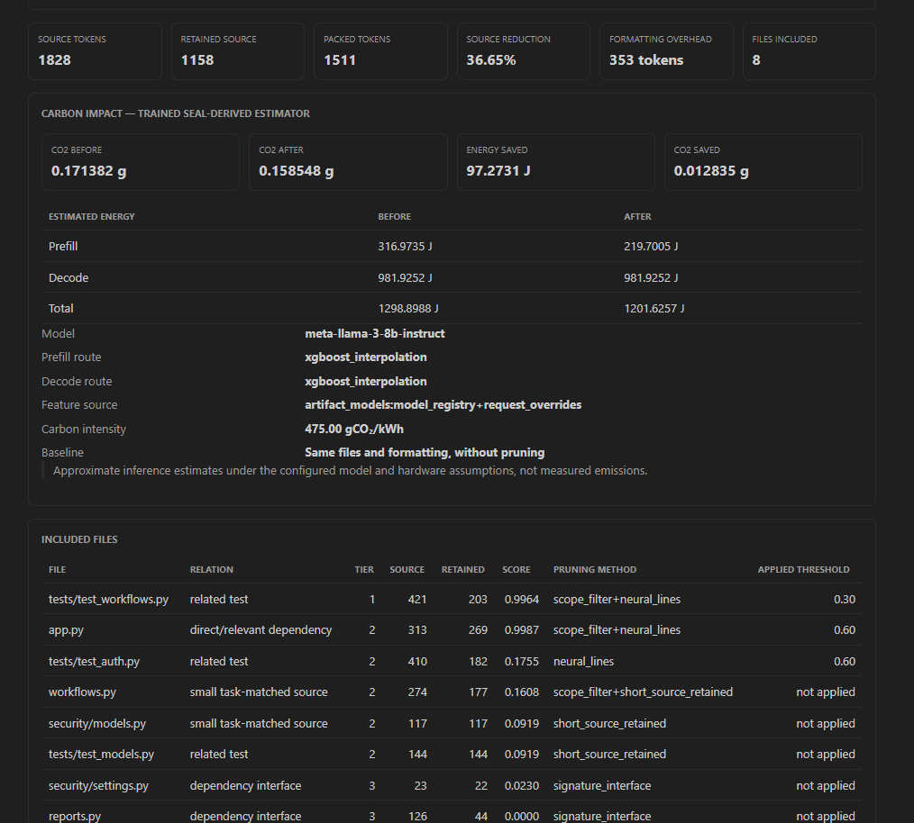
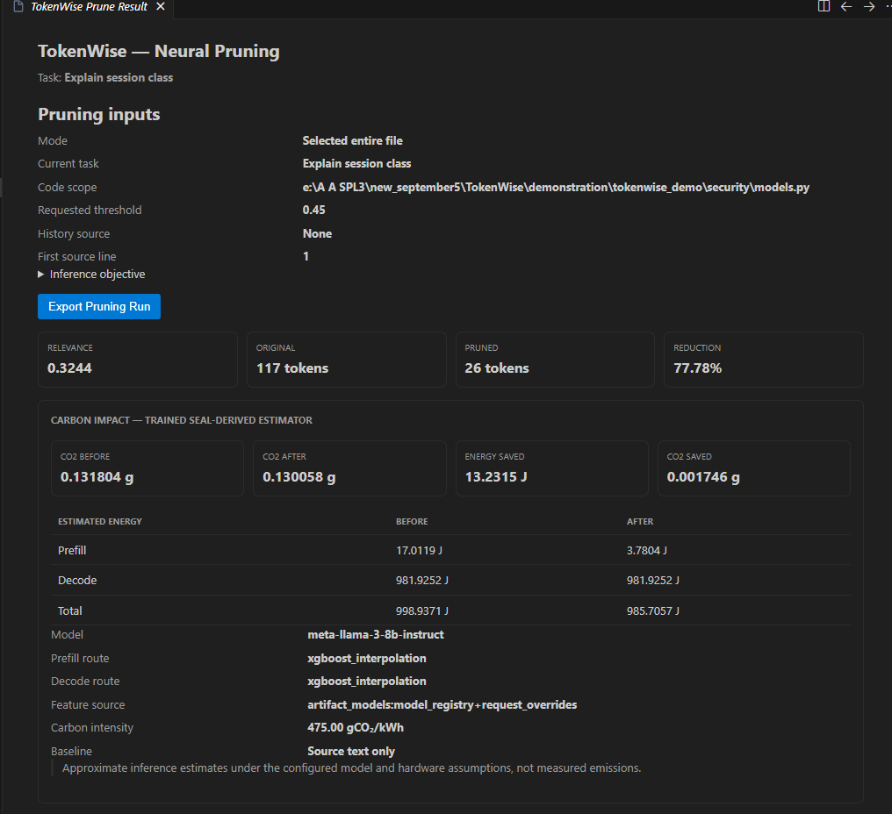

<p align="center">
  
</p>

# TokenWise

**Task-aware Python repository context for Antigravity. One prompt, relevant code and tests, no manual file selection.**

TokenWise is a VS Code-compatible extension with a local Python backend. It finds
repository code relevant to your task, reduces it where appropriate, and supplies
a token-bounded context packet to Antigravity. Inspect the selected files, retained
source, pruning decisions, conversation references and estimated carbon impact
instead of treating context preparation as a black box.

**Current release: 0.6.8, Windows-tested beta.** Automatic chat integration targets
Antigravity; manual pruning commands also work in compatible VS Code installations.

[Download the VSIX](https://github.com/adnan-bin-wahid/Tokenwise-updated/releases/download/v0.6.8/tokenwise-vscode-0.6.8.vsix)
| [Release and checksums](https://github.com/adnan-bin-wahid/Tokenwise-updated/releases/tag/v0.6.8)
| [Demo bundle](https://github.com/adnan-bin-wahid/Tokenwise-updated/releases/download/v0.6.8/TokenWise-0.6.8.zip)
| [Classroom walkthrough](demonstration2.md)

**For users:** install the VSIX. No repository clone, Node.js, compilation, F5 or
manual backend-server launch is required.

## Contents

- [What TokenWise does](#what-tokenwise-does)
- [Quick start](#quick-start)
- [See it working](#see-it-working)
- [How it works](#how-it-works)
- [Understand the result panel](#understand-the-result-panel)
- [Conversation memory and response guidance](#conversation-memory-and-response-guidance)
- [Comparison and validation](#comparison-and-validation)
- [Settings and commands](#settings-and-commands)
- [Troubleshooting and updates](#troubleshooting-and-updates)
- [Privacy and limitations](#privacy-and-limitations)
- [Development and project structure](#development-and-project-structure)
- [Documentation](#documentation)
- [Credits and license](#credits-and-license)

## What TokenWise Does

AI coding agents need repository evidence, but attaching everything can exceed a
context budget and selecting files manually can miss dependencies or tests.
TokenWise prepares a smaller, task-focused reference packet while exposing what
was retained and omitted. It is a context-preparation tool, not a replacement for
Antigravity's answer model or a guarantee of a correct answer.

| Capability | What you get |
| --- | --- |
| Automatic repository discovery | Ask a normal coding question without selecting an editor file. |
| Task-aware retrieval | Python AST metadata, lexical search and dependency relationships help locate implementation and tests. |
| Neural and structural reduction | Relevant source can be pruned; supporting files may use signatures or retained short source instead. |
| Complete-packet budget | Excerpts, file headings, guidance and conversation references share one local-token budget. |
| Project overviews | Broad questions use a separate overview path rather than narrowing the search to a package initializer. |
| Inspectable conversation memory | Related earlier user intent can inform follow-ups, with reasons and omissions visible. |
| Response guidance | Task-specific instructions request grounded answers, citations and explicit uncertainty. |
| Incremental background indexing | Saved Python changes update cached search data without rebuilding every unchanged AST. |
| Comparison and export | Compare context strategies or import genuine reported usage from independent Antigravity runs. |
| Carbon estimation | View configured before/after inference estimates, separated from measured emissions. |

## Quick Start

### 1. Check the Requirements

| Requirement | Current support |
| --- | --- |
| Editor | Antigravity IDE with workspace rules and a command tool |
| Python | **64-bit Python 3.12**, available to the installer |
| Workspace | A trusted **local folder** containing Python source |
| Internet | Required for initial dependency and model downloads |
| Storage | Allow approximately **10 GB free**, including environment and caches |
| Memory | **8 GB RAM** is a starting recommendation; larger inputs can need more |
| Compute | CPU supported; a GPU, Ollama and an MCP server are not required |

Windows setup and retrieval are tested. macOS/Linux portable launchers are included
but have not been verified on native machines. Remote SSH, WSL/Dev Containers,
virtual workspaces and browser editors are not supported by this setup workflow.

TokenWise needs no API key of its own. Antigravity model access and billing are
separate. Install Python from [the official Python website](https://www.python.org/downloads/).
Python 3.13 or 3.14 alone does not satisfy the current backend requirement.

### 2. Install the Extension

1. Download [**tokenwise-vscode-0.6.8.vsix**](https://github.com/adnan-bin-wahid/Tokenwise-updated/releases/download/v0.6.8/tokenwise-vscode-0.6.8.vsix).
2. In Antigravity, open **Extensions**, open its **...** menu and select **Install from VSIX...**.
3. Select the downloaded file and reload the editor when prompted.

Use the versioned link above. This is a beta distributed through GitHub, not a
public marketplace listing; GitHub's latest-release shortcut can omit prereleases.
The automatically generated source-code ZIP is not the extension installer.

### 3. Enable Your Python Folder

1. Use **File > Open Folder** to open your Python repository anywhere on your machine.
2. Trust the workspace only if you trust its contents.
3. Open the command palette and run **TokenWise: Enable Automatic Context**.
4. On first use, choose **Install Managed Backend**, review the confirmation and approve **Install Backend**.
5. Wait for the seven setup stages, then confirm enabling TokenWise in this repository.

The installer creates a private environment and downloads approximately **1.35 GB**
of pinned model weights with checksum verification. First setup can take several
minutes. Progress appears in notifications; details appear in **Output > TokenWise Setup**.

**A step failed?** Fix the named cause and choose **Retry Failed Step**. Validated
dependencies and downloads are reused. If you dismissed the notification, run
**TokenWise: Set Up Backend** again. See the [setup and recovery guide](docs/SETUP.md).

Setup preserves unrelated rules and hook handlers; it does not edit application
source. Multiple configured repositories share the centrally managed backend.
In a multi-folder window, choose the repository you want to enable.

### 4. Ask a Normal Question

Start a **new Antigravity chat** and send:

```text
Explain account lockout after failed login attempts and its related tests.
Do not modify any files.
```

Other useful prompts:

```text
Explain session expiry and revocation, not invoice pricing. Do not modify any files.
```

```text
Give me the full overview of my project. Do not modify any files.
```

No file selection or code copy/paste is required. The backend starts when needed;
its first model load can be slower. Approve the local context command if your
Antigravity permission policy asks. Unrestricted terminal execution is not required.

**Want a ready-made project?** Download the [demo bundle](https://github.com/adnan-bin-wahid/Tokenwise-updated/releases/download/v0.6.8/TokenWise-0.6.8.zip)
and open `demonstration/tokenwise_demo`, or open that folder in this checkout.
Follow [demonstration2.md](demonstration2.md) for a short classroom walkthrough.

## See It Working



*Recorded report screenshot: Antigravity acknowledges retrieved context from
application, security and workflow files before giving a project summary. Visible
waiting messages belong to this recording, not a speed benchmark.*

Check these signals after your own prompt:

- **Customizations > Rules** contains a TokenWise workspace rule.
- The current chat invokes the context command and receives `[TokenWise automatic context]`.
- The status bar reports **TokenWise Auto: N files, N tokens**; **Show Automatic Context** opens the latest panel.
- `.tokenwise/latest.json` has a fresh timestamp, your current query, `status: "ready"` and `verification: false`.

An old panel or status bar alone proves neither a new retrieval nor model
consumption. Historical results are labeled **TokenWise last result**; verifier
activity is labeled **TokenWise test**. Check the current chat's tool output too.

## How It Works

```text
Your prompt + eligible earlier user intent
                  |
         Automatic-context adapter
                  |
    Local index -> task-aware file retrieval
                  |
  Neural pruning / structural representation
                  |
  Budgeted excerpts + provenance + response guidance
                  |
     Antigravity tool output or supported hook
                  |
        Antigravity's answer model
```

1. **Configure.** Register the backend and add owned workspace rules/launchers.
2. **Index.** Saved Python files supply ASTs, symbols, signatures, lexical counts and static dependency data. File events update affected metadata; reconciliation catches missed events.
3. **Interpret.** A deterministic goal compiler identifies task focus and recognized exclusions. An optional local goal model is off by default.
4. **Retrieve.** Search and graph relationships choose implementation, helpers and related tests. Overview requests take a separate architecture-oriented path.
5. **Reduce and pack.** Source may receive neural line pruning; supporting files can use interfaces or retained short source. The complete packet must fit the configured budget.
6. **Deliver and inspect.** Antigravity receives the packet and the extension exposes provenance. Carbon estimates and optional packet comparison load separately.

**Integration boundary:** on supported IDE builds, a native `PreInvocation` hook
can inject context. The stable fallback uses an always-on rule asking the agent
to run a local context command. It depends on rule compliance and command approval;
it is not guaranteed interception before the first model call.
See [the integration guide](docs/ANTIGRAVITY.md) for transport details.

Background indexing warms configured, trusted folders. Search data is reused
across different prompts; complete results require exact request/cache identity
and the source fingerprint. Unsaved buffers are not indexed. Reconciliation runs
approximately every two minutes; see **Output > TokenWise Index** for updates.

## Understand the Result Panel



*Recorded session-expiry/revocation result: eight files, 1,828 source tokens,
1,158 retained source tokens and a 1,511-token complete packet. These are one
example, not guaranteed values for another repository.*

| Value | Meaning |
| --- | --- |
| **Source tokens** | Original source in the included files, not all repository files. |
| **Retained source** | Remaining source, excluding packet headings and instructions. |
| **Packed tokens** | Complete packet: source, headings, safety text and any guidance/history. This is the budgeted quantity. |
| **Source reduction** | `(source - retained source) / source x 100`; the screenshot shows 36.65%. |
| **Formatting overhead** | Packed minus retained-source tokens: 353 in this example. Boundary tokenization is not perfectly additive. |
| **Files included** | Files represented in the packet, not observed Antigravity file reads. |
| **Included-file table** | Path, relationship, tier, original/retained counts, ranking score, representation method and effective threshold. |
| **Score / threshold** | Selection diagnostics, not answer correctness. Tiers may use different thresholds; some representations do not apply a neural cutoff. |

Counts use TokenWise's local model tokenizer, not necessarily your Antigravity
model's tokenizer or billing counters. A small source can produce a larger packet
because of formatting; genuine increases are disclosed. Keeping all 17 source
tokens in a 117-token packet means **0% source reduction and 100 tokens of overhead**.

### Carbon Values

The panel estimates input-processing (**prefill**) and output-generation
(**decode**) energy under a configured model/hardware scenario. Before/after
predictions share assumptions; the input-context size changes.

In this screenshot, estimated CO2 changes from **0.171382 g to 0.158548 g**,
with **97.2731 J** estimated energy saved and **0.012835 g** estimated CO2 saved.
Decode energy is unchanged because the assumed output-token count is unchanged.
The baseline is **the same files and formatting without pruning**, not every
repository file. Small display-rounding differences are possible.

**These are trained, SEAL-derived scenario estimates, not measured Antigravity
emissions, provider usage or net environmental savings.** Local pruning energy
is not included. Pending, disabled and failed estimates are explicit; a carbon
error does not discard usable context.

### Selected-File Neural Pruning



*A separate recorded run asks about the `Session` class in `security/models.py`.
Source changes from 117 to 26 tokens, a 77.78% reduction. The requested 0.45
threshold is a relevance cutoff, not a promise of 45% savings.*

Use **Prune Current File**, **Prune Selected Code** or **Demonstrate Pruning Inputs**
to inspect a captured scope and line decisions. These commands do not overwrite
the original file. Direct pruning output is an excerpt, not necessarily standalone
executable code or a complete explanation.

These unchanged report assets have [source and interpretation notes](docs/images/README.md).

## Conversation Memory and Response Guidance

**Memory in 0.6.8** can select up to **eight relevant earlier user turns / 4,000
characters** from bounded same-chat candidates. A follow-up such as `What about
its expiry boundary?` can retain the earlier topic and recognized requirements.
The panel explains selection reasons, omissions, truncation and outgoing references.

This is deterministic lexical selection, not perfect semantic understanding or
full-chat replay. Assistant replies, tool output and prior injected packets are
excluded. Native history must be chat-scoped and verified; fallback references
are agent-supplied and labeled accordingly. New/unrelated chats must not inherit
prior intent. History shares the complete budget and can be omitted.

**Response guidance** adds bounded, task-specific prompt engineering: cite source
files/symbols, respect requested scope, distinguish evidence from assumptions and
never claim unexecuted tests passed. Explanation, debugging, test and overview
tasks use different profiles. No extra LLM call is made. This is an implemented
technique, not proof that every downstream answer becomes better.

## Comparison and Validation

TokenWise separates **prepared context measurements** from **live agent outcomes**.

| Comparison | Establishes | Does not establish |
| --- | --- | --- |
| **Compare Context Strategies** | Local sizes for all-Python, selected-source and bounded packets. | How Antigravity actually reads files without TokenWise. |
| **Configure Automatic Comparison** | The exact outgoing packet versus an all-indexed-Python baseline. | Billed model usage or automatically better answers. |
| **Import Antigravity Usage Comparison** | Genuine counters, durations and completed traces from independent successful single-turn CLI runs. | Missing counters, automatic grading or an unperformed study. |

Automatic packet comparison is **off by default**. Enable it through the command
palette to see local differences and export JSON. It reuses prepared context and
does not launch a second model answer. Changed snapshots require a fresh prompt.
The all-Python baseline is hypothetical, not observed IDE behavior.

### Recorded Component Study

The [completed local study](https://github.com/adnan-bin-wahid/Tokenwise-updated/blob/main/comparative_study.md) covers **20 pinned Python
repositories and 140 measured context packets**, separating neural and retrieval-only conditions.

| Recorded finding | Scope |
| --- | --- |
| **93.58% aggregate packet reduction** | Retrieval-only ablation versus all-Python packets, not the full automatic neural pipeline. |
| **3.25% additional aggregate reduction** | Real neural pruning versus the exact already-focused selected excerpts. |
| **17/20 target anchors retained** | Three neural excerpt cases lost required implementation evidence. |
| **33/43 to 40/43 required-file candidate coverage** | Same vague follow-up, memory off/on in retrieval-only conditions. |

These findings support bounded selection and reveal preservation limitations.
They do **not** establish improved Antigravity answer quality, actual cloud-token
savings or measured emissions. The planned **120 live runs / 60 matched pairs**
are separate from the completed component study and remain pending.

For a fair live comparison, send the same task in separate fresh chats with
TokenWise disabled/enabled. Keep model, source, permissions and rubric fixed;
include retrieval overhead in answer time. Score supported facts and unsupported
claims, record observed reads and keep **N/A** for unavailable genuine input-token counters.

- [Short demonstration](demonstration2.md): one project and a straightforward walkthrough.
- [Validation protocol](validation.md): controls, six-fact rubrics and evidence collection.
- [Twenty study repositories](https://github.com/adnan-bin-wahid/Tokenwise-updated/tree/main/demonstration/comparative_study): open one numbered folder; tasks and a 120-run worksheet are included.
- [Recorded test report](https://github.com/adnan-bin-wahid/Tokenwise-updated/blob/main/tests.md): 193 extension passes, 141 backend passes plus one skip, 20 demo passes and 10 browser views, dated October 9, 2026. A README edit does not rerun these tests.

## Settings and Commands

After setup, edit only the properties you need in `.agents/tokenwise.json`,
retaining its existing fields:

```json
{
  "enabled": true,
  "token_budget": 4096,
  "threshold": 0.45,
  "max_candidates": 8,
  "conversation_memory": true,
  "response_guidance": true
}
```

The budget defaults to **4,096 local tokens**; range **256-32,768**. This is an
example, not a replacement for your generated file. Set `enabled` to `false`
to stop automatic retrieval/indexing; disable memory or guidance individually
with their booleans. Smaller budgets/candidate limits can omit useful evidence.

Editor settings **Auto Open Automatic Context** and **Enable Carbon Estimation**
control the panel and estimates. Manual repository commands use editor **Enable
Response Guidance** separately from the workspace setting.

| Command | Purpose |
| --- | --- |
| **TokenWise: Enable Automatic Context** | Configure a workspace or refresh owned integration. |
| **TokenWise: Set Up Backend** | Install, update or repair the managed backend. |
| **TokenWise: Start Backend** | Warm the backend/model before a prompt. |
| **TokenWise: Diagnose Setup** | Check registration, health and workspace links. |
| **TokenWise: Show Automatic Context** | Reopen the latest result. |
| **TokenWise: Build Repository Context** | Prepare repository context manually. |
| **TokenWise: Prune Current File / Prune Selected Code** | Reduce explicitly captured source; two separate commands. |
| **TokenWise: Demonstrate Pruning Inputs** | Inspect discovery, selected source or supplied user-history replay. |
| **TokenWise: Configure Automatic Comparison** | Enable, disable or retry packet comparison. |
| **TokenWise: Compare Context Strategies** | Compare manually prepared strategies. |
| **TokenWise: Import Antigravity Usage Comparison** | Import independent successful CLI evidence. |
| **TokenWise: Open Setup / Demonstration / Validation Guide** | Open a bundled guide; three separate commands. |
| **TokenWise: Remove All Local Data** | Ownership-aware cleanup before uninstalling or starting over. |

## Troubleshooting and Updates

| Problem | First action |
| --- | --- |
| Python not detected | Install 64-bit Python 3.12, restart or set **TokenWise > Python Path**. |
| Setup/download fails | Read **Output > TokenWise Setup**, fix the named stage and **Retry Failed Step**. |
| No context reaches chat | New chat, workspace rule, command approval and fresh tool output. |
| Old result appears | Check query/timestamp and repeat a fresh prompt. |
| Backend offline | **Diagnose Setup**, then **Start Backend**; inspect the reported log. |
| Slow retrieval | Allow first model load, keep the backend warm, check **TokenWise Index** and consider a smaller budget/candidate limit. |
| CO2 unavailable | Read the displayed error, check settings and backend version; context remains usable. |
| Moved/cloned workspace | **Enable Automatic Context** recreates the machine-specific backend link. |

**Upgrade:** install the newer VSIX, reload, run **Set Up Backend**, then run
**Enable Automatic Context** again in existing workspaces and start a new chat.
The extension alone does not update an old running Python backend. Verified
downloads are reusable; uninstalling is not an upgrade step. User-owned checkout
backends must be updated/restarted by their owner.

See [setup and recovery](docs/SETUP.md) for all stages and cleanup.
Version history is in [CHANGELOG.md](https://github.com/adnan-bin-wahid/Tokenwise-updated/blob/main/CHANGELOG.md).

## Privacy and Limitations

- **Local preparation, normal model delivery.** The backend normally uses `127.0.0.1` and does not execute repository Python. Excerpts subsequently enter Antigravity's provider request: local pruning does not mean code never leaves your machine.
- **Initial downloads.** Setup contacts dependency/model hosts. Optional goal-generation endpoints require separate configuration.
- **Sensitive records.** Ignored `.tokenwise/` contains prompt/context records and a machine-specific link. Do not commit/share it. Environments/models/logs live in extension user storage.
- **Incomplete evidence.** Static relationships can miss dynamic imports, generated code, ignored/large files or unsupported syntax. Pruning can remove useful lines. Read originals before editing.
- **No universal speed/quality promise.** Local neural inference has overhead. Memory/guidance are not guaranteed improvements; live paired evaluation is needed.
- **Safe cleanup.** Uninstall removes verified owned data when editor removal completes, potentially after restart. Customized files, checkout backends and unrelated data are preserved. For visible cleanup run **Remove All Local Data** first. Editor history, backups, Git history and downloaded installers are not wiped.

## Development and Project Structure

Normal users do not need these commands. Contributors with Node.js/npm can run:

```powershell
cd vscode-extension
npm ci
npm test
npm run prepare-backend
npm run compile
```

F5 is for extension development. Source-backend setup is in
[DEVELOPMENT.md](docs/DEVELOPMENT.md). `npm run package` prepares a shareable
VSIX/release folder; it does not publish automatically. Assign a new version for
changed releases; never replace existing assets with another build under the same version.

| Path | Responsibility |
| --- | --- |
| `vscode-extension/` | TypeScript extension, commands, setup, file watchers and result views. |
| `swe-pruner/swe-pruner/src/swe_pruner/` | Python API, index, retrieval, pruning, packing and estimation integration. |
| `scripts/` | Installers, adapters, packaging, verification and study tooling. |
| `carbon-engine/` | Carbon-estimator research/training pipeline. |
| `demonstration/tokenwise_demo/` | One deterministic classroom application with 20 tests. |
| `demonstration/comparative_study/` | Twenty attributed, pinned upstream study snapshots. |
| `evaluation/` | Component-study data, figures and verification evidence. |
| `docs/` | Setup, integration, development, evaluation and notices. |

## Documentation

| Read this | When you need |
| --- | --- |
| [Setup and recovery](docs/SETUP.md) | Python checks, failed-stage retry, upgrades and cleanup. |
| [Short classroom walkthrough](demonstration2.md) | A straightforward one-project demonstration. |
| [Detailed demonstration](demonstation.md) | Input modes, decisions, memory/guidance and exports. |
| [Validation](validation.md) | Controlled WITH/WITHOUT procedures and scoring. |
| [Comparative study](https://github.com/adnan-bin-wahid/Tokenwise-updated/blob/main/comparative_study.md) | Completed local measurements and limitations. |
| [Test report](https://github.com/adnan-bin-wahid/Tokenwise-updated/blob/main/tests.md) | Dated counts, browser checks and the platform skip. |
| [Full project study](study.md) | Detailed implementation and defense preparation. |
| [Development](docs/DEVELOPMENT.md) | Source setup, tests and backend lifecycle. |
| [Publishing](docs/PUBLISHING.md) | Versioned packaging and release verification. |

## Credits and License

TokenWise source is [MIT licensed](https://github.com/adnan-bin-wahid/Tokenwise-updated/blob/main/LICENSE). Its neural pruner builds on
[SWE-Pruner](https://github.com/Ayanami1314/swe-pruner), with pinned weights from
[ayanami-kitasan/code-pruner](https://huggingface.co/ayanami-kitasan/code-pruner).
Carbon estimates use trained SEAL-derived artifacts and configured assumptions.
Model assets, dependencies and upstream study snapshots retain their respective
licenses. See [third-party notices](docs/THIRD-PARTY-NOTICES.md) and each snapshot's license.
