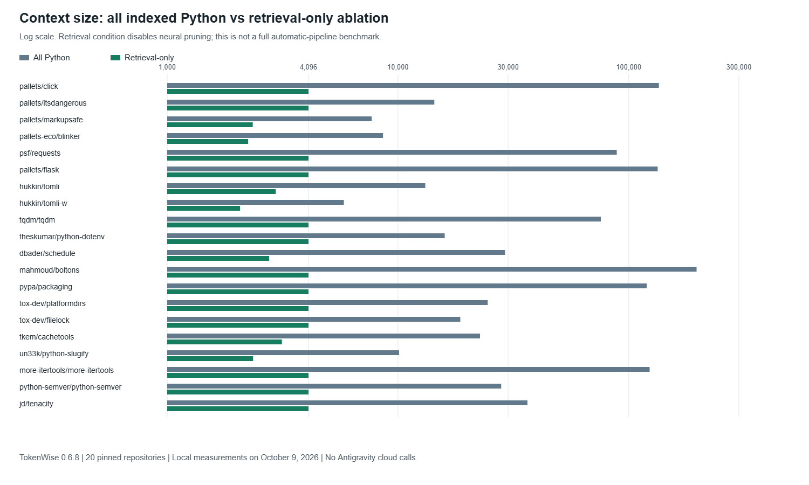
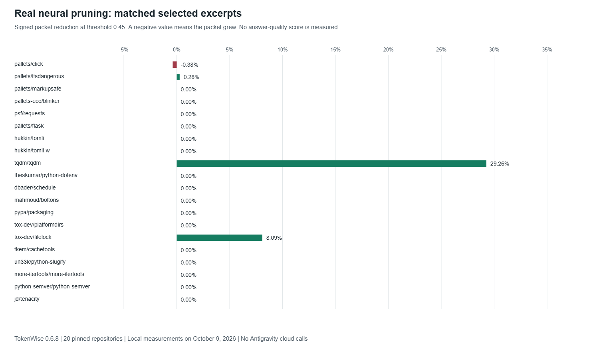
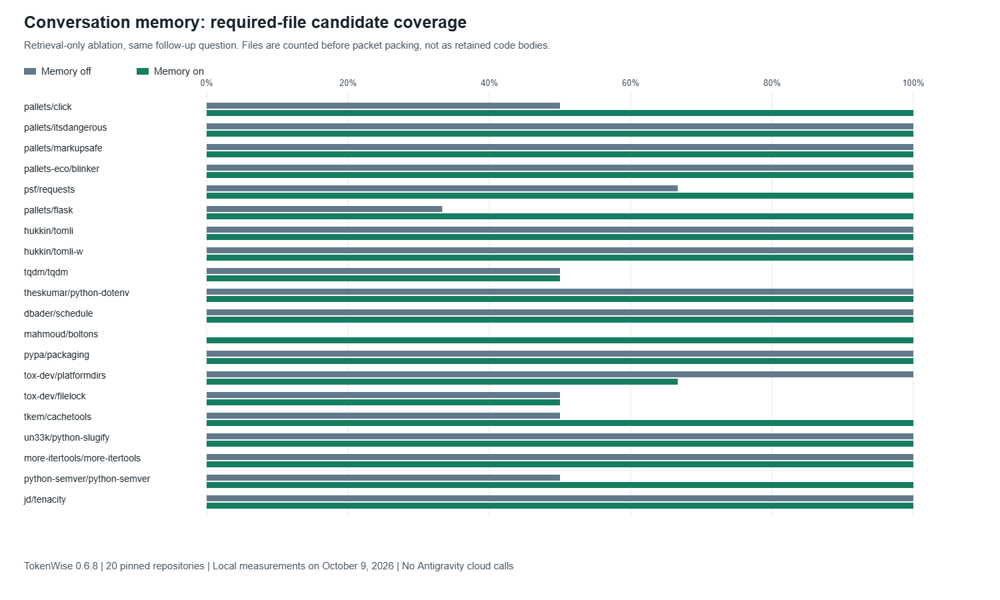

# TokenWise Comparative Study

## 1. Executive Summary

**Study date:** October 9, 2026. **Implementation:** TokenWise 0.6.8.
**Backend implementation commit:** `573b82bcb2eb4856f1f4af65eb5735e3f6475404`.
**Dataset:** 20 pinned public Python repositories, 538 indexed Python files,
4,381,075 bytes of indexed source, and 59 predefined source-evidence anchors.

This is a **completed local, component-level comparative study**, not a completed
Antigravity answer-quality or full automatic-agent benchmark. Real TokenWise
neural weights were used for twenty selected-source excerpt requests. Repository
retrieval and conversation memory were evaluated in separately labeled
**retrieval-only ablations**, with neural ranking/line pruning disabled.
Seven conditions per repository produced **140 measured context packets**.

The important findings are:

| Question | Observed result | Interpretation |
|---|---|---|
| Does every Python file fit a 4096-token context budget? | None of the twenty all-code packets fit | Whole-repository context is expensive in this sample |
| Does manual file selection always fit? | Eleven of twenty selected-file packets exceeded 4096 tokens | Selecting a file is not sufficient to guarantee a bounded context |
| Does bounded retrieval reduce context volume? | Retrieval-only packets totaled 71,119 tokens versus 1,107,232 all-code tokens: **93.58% aggregate reduction** | Demonstrates bounded selection/interface packing, not the complete neural automatic pipeline |
| Does pruning an already focused excerpt help? | 7,575 packet tokens became 7,329: **3.25% aggregate reduction** | Most savings had already come from manual selection, not neural pruning |
| Does neural pruning always preserve the target evidence? | Chosen implementation anchors survived in **17/20** excerpts | Three cases lost the required definition/body-anchor pair |
| Does earlier user intent help a vague follow-up? | Required-file candidate coverage rose from **33/43 to 40/43** | Memory improved topic-directed retrieval on average, but not every case |
| Does memory always improve coverage? | Six cases improved, thirteen tied, one worsened | Memory is useful but not universally beneficial |
| Are smaller packets automatically better answers? | No downstream answers were generated/scored | This study cannot establish that claim |

**Central conclusion:** TokenWise's bounded context selection and scoped memory
make a measurable difference, but token savings alone are not validation of
answer quality. The results also expose limitations in source preservation,
test-body retention and large-file CPU inference. These are findings to discuss,
not hide, in a project defense.

## 2. Research Questions

1. **RQ1: Context volume.** How do all-code, selected-file and bounded context
   strategies differ in packet tokens and budget compliance?
2. **RQ2: Neural contribution.** For exactly the same selected source excerpt,
   how much additional reduction comes from the actual neural pruner, and does
   the selected implementation evidence survive?
3. **RQ3: Conversation memory.** With the same vague follow-up question, does
   bounded earlier user intent improve retrieval of the expected implementation
   and test files?
4. **RQ4: Local cost.** How expensive are index preparation, warm search and
   bounded neural inference on this machine?
5. **RQ5: Estimated sustainability.** Under fixed carbon-estimator assumptions,
   how does a measured change in packet size change estimated inference emissions?

These questions separate context selection, line pruning, memory and estimation.
They avoid attributing every difference to one feature called "TokenWise."

## 3. Dataset and Source Provenance

The sample consists of established Python libraries with public source and tests,
covering command-line interfaces, web/HTTP behavior, signing/escaping, parsing,
serialization, caching, scheduling, paths, locks, text processing and retries.
This is a **purposive convenience sample**, not a random sample of all Python
repositories. Several repositories share maintainers/ecosystems and are not
independent observations from an unbiased population.

Historical tags were selected for reproducible, manageable snapshots. They are
**not presented as the latest versions** or security recommendations. Each tag
was resolved to a forty-character commit SHA before downloading. The archive
SHA-256, source fingerprint, indexed file count and evidence criteria are saved
in [snapshots.json](evaluation/comparative-study/snapshots.json). Exact full commit
pins and source links are in [the generated pin table](evaluation/comparative-study/tables.md#exact-source-pins).

| Repository | Tag | Indexed Python files | Implementation investigated |
|---|---|---:|---|
| [Click](https://github.com/pallets/click/tree/934813e4d421071a1b3db3973c02fe2721359a6e) | 8.1.8 | 70 | `IntRange` validation through `_NumberRangeBase.convert` |
| [ItsDangerous](https://github.com/pallets/itsdangerous/tree/096c8d42545d3b68ea21a4f890fb2b2d8979c0bd) | 2.2.0 | 15 | `TimestampSigner.unsign` expiry checking |
| [MarkupSafe](https://github.com/pallets/markupsafe/tree/28ace20b140d15c083e1cbc163ee6b7778ba098c) | 3.0.2 | 11 | `escape` special-character handling |
| [Blinker](https://github.com/pallets-eco/blinker/tree/669f3a027828d19786e708b511277fabcd6b9532) | 1.9.0 | 7 | `Signal.send` receiver dispatch |
| [Requests](https://github.com/psf/requests/tree/0e322af87745eff34caffe4df68456ebc20d9068) | v2.32.3 | 36 | `Response.json` decoding/error handling |
| [Flask](https://github.com/pallets/flask/tree/ab8149664182b662453a563161aa89013c806dc9) | 3.1.0 | 83 | `RequestContext.pop` cleanup |
| [Tomli](https://github.com/hukkin/tomli/tree/73c3d102eb81fe0d2b87f905df4f740f8878d8da) | 2.2.1 | 14 | `loads` TOML parsing |
| [Tomli-W](https://github.com/hukkin/tomli-w/tree/a8f80172ba16fe694e37f6e07e6352ecee384c58) | 1.2.0 | 10 | `dumps` TOML serialization |
| [tqdm](https://github.com/tqdm/tqdm/tree/0ed5d7f18fa3153834cbac0aa57e8092b217cc16) | v4.67.1 | 62 | `tqdm.update` refresh behavior |
| [python-dotenv](https://github.com/theskumar/python-dotenv/tree/d6c0b9638349a7dd605d60ee555ff60421c1a594) | v1.0.1 | 18 | `load_dotenv` overwrite behavior |
| [Schedule](https://github.com/dbader/schedule/tree/82a43db1b938d8fdf60103bd41f329e06c8d3651) | 1.2.2 | 4 | `Scheduler.run_pending` |
| [Boltons](https://github.com/mahmoud/boltons/tree/5aed99eb066f563fbad2231498492df8403a643d) | 24.1.0 | 65 | `LRI.__setitem__` eviction |
| [Packaging](https://github.com/pypa/packaging/tree/d8e3b31b734926ebbcaff654279f6855a73e052f) | 24.2 | 35 | `Version.__init__` validation |
| [Platformdirs](https://github.com/tox-dev/platformdirs/tree/bc0405cb9c9439e6923b2dc090f91ad5daaf7dec) | 4.3.6 | 15 | `Unix.user_cache_dir` |
| [Filelock](https://github.com/tox-dev/filelock/tree/c2c43e456b4369ecac8c932115e41b3addc5c3d6) | 3.16.1 | 13 | `BaseFileLock.acquire` timeout/blocking |
| [Cachetools](https://github.com/tkem/cachetools/tree/b072920d6cfb803be7dbbc7eafd9adc61c5c3cbd) | v5.5.1 | 18 | `TTLCache.__getitem__` expiry |
| [python-slugify](https://github.com/un33k/python-slugify/tree/f85f9488520148d5f6899b5639199882b605e30a) | v8.0.4 | 7 | `slugify` normalization/truncation |
| [More Itertools](https://github.com/more-itertools/more-itertools/tree/1681cea3cd8fd1bfce41ac5db3987ae919d51b84) | v10.6.0 | 8 | `chunked_even` grouping |
| [Python Semver](https://github.com/python-semver/python-semver/tree/486e4897da9fa6f02e1392bbf24d2f69599f0970) | 3.0.3 | 26 | `Version.bump_patch` |
| [Tenacity](https://github.com/jd/tenacity/tree/a662bbb487cd6d34541824589f8e8c7a1f7791bb) | 9.0.0 | 21 | `stop_after_attempt.__call__` |

All indexed `.py` files were retained, including tests and examples where indexed.
The production indexer's directory exclusions applied. Root documents/license
metadata were retained locally, but **the all-code packet contains Python only**.
No downloaded project code was imported, installed or executed. The study does
not claim that all twenty upstream projects passed their own test suites.

The extension's existing comparison export guard allows at most 200 indexed
Python files and 2 MiB of source per repository. Every selected snapshot passed
that guard; repository selection is consequently biased toward manageable projects.

## 4. Environment and Fixed Settings

| Item | Setting / observation |
|---|---|
| Operating system | Windows 11, build 26200 |
| Processor | Intel Core i5-13400, 10 cores / 16 logical processors |
| Visible physical memory | Approximately 15.77 GiB |
| Python | 3.12.4, 64-bit |
| PyTorch | 2.14.1+cpu |
| Transformers / Tokenizers | 4.57.6 / 0.22.2 |
| FastAPI | 0.141.1 |
| scikit-learn / XGBoost | 1.9.0 / 3.3.0 |
| Device / inference threads | CPU / 4 |
| Neural threshold | 0.45 |
| Neural excerpt source ceiling | 1024 local tokenizer tokens |
| Repository packet budget | 4096 local tokenizer tokens |
| Retrieval candidates | At most 8 |
| Goal synthesis | Production deterministic compiler; no optional external local LLM |
| Response guidance | Enabled in retrieval ablations |
| Memory references | Explicit task plus `Use bullet points.`; current follow-up identical on/off |
| Downstream Antigravity calls | None |

The real local SWE-Pruner-derived checkpoint was loaded, not a simulated model.
Its SHA-256 was:

```text
373b77f5262c3298b803303d49ea38949d3e92f08dc3bbb90b03f490413adae9
```

Both the local counting tokenizer and backend tokenizer were loaded from the
same offline model directory. Excerpt source counts were checked against the
backend's `origin_token_cnt`. Actual neural model inputs ranged from **119 to
1038 tokens** after query/instruction formatting. None of the twenty target
functions exceeded the configured source-excerpt ceiling, so **no target
function was clipped** in the completed run.

The successful run was recorded between **08:29:01 and 08:30:13 UTC**. This is
one machine and one pass over distinct tasks, not a multi-hardware benchmark.
There was no controlled process-affinity, temperature or power-meter experiment.

## 5. Experimental Conditions

### A. All Python Code (`all_python`)

Every indexed Python file is serialized in sorted order, with file headings and
code fences. Nothing is pruned. This is a hypothetical prepared-context baseline;
it is **not observed Antigravity behavior with TokenWise disabled**. Antigravity
may independently choose files, cache tokens or use other system/history context.

### B. Selected Entire File (`selected_file`)

The manifest's implementation file is serialized without pruning. The selection
is deliberately informed: the harness already knows where the implementation is.
It is not a randomly selected or deliberately incorrect file. Manual selection
cost and developer effort were not timed. Related test files are not included.

### C. Selected Function/Method Excerpt (`selected_excerpt`)

The implementation AST node is extracted from the saved file. Overloaded
declarations are resolved to the final implementation definition. The source
limit is 1024 tokens, with clipping at complete source lines if needed; clipping
was unnecessary in this dataset. This is an **oracle-assisted selection baseline**:
it represents a developer who already knows the relevant function.

The excerpt is context, not necessarily standalone executable code. Methods can
depend on their enclosing class, imports and constants omitted by selection.

### D. Real Neural Pruning of Exactly That Excerpt (`neural_excerpt`)

The same excerpt and task are sent to the actual `/prune` endpoint at threshold
0.45, matching the single-selection pruning API path. No fake relevance scorer
is used. Before/after packets share the same file heading, preamble and fence
format, isolating the neural output and its elision formatting.

**C versus D is the valid matched neural-pruning comparison.** Comparing A with D
also includes the large benefit of manual source selection and must not be
presented as the neural model alone saving approximately 99% of the repository.

### E. Repository Retrieval-Only Ablation (`retrieval_only`)

The production index, prepared lexical search/dependency graph, deterministic
goal compiler and `ContextBuilder` are reused. Query matches and identifier
seeds are expanded through the graph, at most eight candidates are chosen, and
a 4096-token packet is built. Neural ranking and line pruning are disabled:
interfaces are packed, with task-matched source of at most 512 tokens retained
through the existing preservation path.

The study harness's candidate policy is deliberately explicit and simplified;
it does not reproduce every configuration reservation, exclusion filter or neural
ranking decision of `/prune-workspace`. It is an **ablated retrieval/packing
condition**, not the default complete automatic extension output. No model double
pretends to provide neural scores. Its packet preamble states that pruning is disabled.

### F/G. Same Follow-Up, Memory Off and On (`history_off` / `history_on`)

Both conditions use the retrieval-only ablation and exactly this question:

```text
Which tests cover that behavior? Do not modify any files.
```

For memory-on, the production selector receives these earlier user turns:

```text
[the repository's explicit implementation question]
Use bullet points.
```

For memory-off, no hint is supplied. No active file, assistant answer or tool
output supplies the missing topic. This evaluates **the memory-selection and
retrieval algorithms with a controlled history**, not native transcript capture
or a real Antigravity conversation. Any improvement applies to this setup only.

## 6. Evidence Criteria and Measurement Rules

Before inspecting neural outputs, the preparation phase froze one implementation
anchor and up to two assertion-bearing related test anchors for each repository.
Click had one qualifying representative test under this rule, so its total is
two anchors; each other repository has three. There are **59 anchors overall**.

Implementation selection uses the configured qualified AST symbol. Its body
anchor is the first sufficiently long non-comment source line unique in the file,
or a fallback line if none is unique. Tests are selected deterministically in
file/source order using symbol association in the function or enclosing test
class, plus an `assert` statement or unittest assertion call. The first assertion
line is the test body anchor.

An anchor is retained only when both its function declaration and body/assertion
line are found in the **correct file's source fence**, after whitespace
normalization. Task text, memory text and filenames alone cannot satisfy it.
The all-code baseline must contain every anchor as an instrumentation sanity check.

These are **syntactic evidence proxies**, not independently adjudicated complete
ground truth. Symbol association can admit broad tests, and a first assertion
does not establish complete behavioral coverage. A missing anchor is an evidence
retention failure under this rubric, not proof that every possible downstream
answer must be wrong. A retained anchor is not proof of complete function semantics.

Separate metrics are used:

| Metric | Definition |
|---|---|
| Packet tokens | Exact local-tokenizer count of the complete packet, including formatting |
| Budget compliance | Packet count at most 4096 in bounded retrieval conditions |
| Evidence retention | Declaration **and** body anchor found in the correct source block |
| Required-file coverage | Required implementation/test filenames present in the candidate set **before packing** |
| Index preparation time | Building/synchronizing the index and preparing lexical/graph structures |
| Warm search time | Median of three index reuse + lexical search + graph-expansion calls per repository |
| Neural time | Wall-clock HTTP request time for the bounded `/prune` operation |
| Estimated CO2 | Carbon endpoint output under the fixed scenario below |

Candidate-file coverage and final body-evidence retention are deliberately not
interchanged. A retrieved file can be packed only as signatures or omitted by
the budget, so finding its path does not mean its relevant body reached the model.

Signed packet reduction is:

```text
100 * (before_packet_tokens - after_packet_tokens) / before_packet_tokens
```

Aggregate reduction uses sums of packet tokens; mean per-repository reduction
gives every repository equal weight. They are different statistics. Large
repositories dominate the aggregate ratio. Negative values are reported as
growth, not clamped to zero or presented as a successful saving.

No p-value or population confidence claim is made from this small convenience
sample. Descriptive means, medians, ranges and case counts are sufficient here.

## 7. Per-Repository Token Results

All counts below are complete packets using the same local tokenizer. The last
column is the **retrieval-only ablation**, not full automatic neural retrieval.

| Repository | All Python | Selected file | Excerpt before | Neural after | Matched neural reduction | Retrieval-only |
|---|---:|---:|---:|---:|---:|---:|
| Click | 135,043 | 8,292 | 264 | 265 | -0.38% | 4,095 |
| ItsDangerous | 14,370 | 1,810 | 721 | 719 | 0.28% | 4,096 |
| MarkupSafe | 7,695 | 3,427 | 278 | 278 | 0.00% | 2,348 |
| Blinker | 8,612 | 4,188 | 436 | 436 | 0.00% | 2,243 |
| Requests | 88,709 | 7,590 | 378 | 378 | 0.00% | 4,096 |
| Flask | 133,434 | 3,382 | 329 | 329 | 0.00% | 4,095 |
| Tomli | 13,128 | 6,533 | 600 | 600 | 0.00% | 2,954 |
| Tomli-W | 5,827 | 1,840 | 104 | 104 | 0.00% | 2,069 |
| tqdm | 75,649 | 13,079 | 622 | 440 | 29.26% | 4,095 |
| python-dotenv | 15,937 | 2,787 | 342 | 342 | 0.00% | 4,096 |
| Schedule | 29,086 | 7,190 | 166 | 166 | 0.00% | 2,765 |
| Boltons | 196,713 | 7,239 | 162 | 162 | 0.00% | 4,096 |
| Packaging | 119,637 | 4,330 | 357 | 357 | 0.00% | 4,095 |
| Platformdirs | 24,480 | 2,633 | 149 | 149 | 0.00% | 4,096 |
| Filelock | 18,619 | 3,282 | 779 | 716 | 8.09% | 4,096 |
| Cachetools | 22,669 | 5,613 | 125 | 125 | 0.00% | 3,141 |
| python-slugify | 10,110 | 1,480 | 993 | 993 | 0.00% | 2,356 |
| More Itertools | 123,127 | 41,677 | 539 | 539 | 0.00% | 4,096 |
| Python Semver | 28,000 | 5,943 | 157 | 157 | 0.00% | 4,096 |
| Tenacity | 36,387 | 1,026 | 74 | 74 | 0.00% | 4,095 |



### Aggregate Context and Evidence

| Condition | Total packet tokens | Mean tokens | Macro anchor recall | Anchors retained | Packets above 4096 |
|---|---:|---:|---:|---:|---:|
| All Python | 1,107,232 | 55,361.60 | 100.00% | 59/59 | 20/20 |
| Selected file | 133,341 | 6,667.05 | 34.17% | 20/59 | 11/20 |
| Selected excerpt | 7,575 | 378.75 | 34.17% | 20/59 | 0/20 |
| Neural excerpt | 7,329 | 366.45 | 28.33% | 17/59 | 0/20 |
| Retrieval-only | 71,119 | 3,555.95 | 10.00% | 6/59 | 0/20 |
| Follow-up, memory off | 71,558 | 3,577.90 | 6.67% | 4/59 | 0/20 |
| Follow-up, memory on | 71,248 | 3,562.40 | 10.00% | 6/59 | 0/20 |

Macro recall averages each repository's retained/required anchor ratio. Pooled
anchor recall instead divides the retained totals by 59. Do not substitute one
for the other. The all-code result is a sanity check because those anchors were
derived from the same source, not evidence that an LLM would read or understand all of it.

All bounded retrieval packets met the budget. Their 93.58% aggregate reduction
versus all-code corresponds to **84.75% mean per-repository reduction**, not 93.58%
in every repository. The low body-anchor retention shows why a signatures-heavy
retrieval ablation is insufficient for detailed behavior/test explanations.

## 8. What the Neural Comparison Actually Shows



The matched comparison has these outcomes:

- **3/20** packets shrank, **16/20** were unchanged and **1/20** grew.
- Aggregate packet reduction: **3.25%**; mean per-case reduction: **1.86%**.
- Median per-case reduction: **0.00%**; range: **-0.38% to 29.26%**.
- Source tokens changed from **6,664 to 6,418**; complete packets from **7,575 to 7,329**.
- Implementation definition/body anchors survived in **17/20** neural outputs.

An already selected relevant function often has little irrelevant code to remove.
Leaving it unchanged is not automatically a pruning bug. This sample therefore
tests the incremental benefit after strong manual selection, not the potential
benefit of pruning a large mixed-relevance file. The selected baselines are strong,
not deliberately made weak to manufacture a favorable result.

Three illustrative observations are:

| Case | Observation | Lesson |
|---|---|---|
| Click | 264 became 265 tokens; required implementation anchor pair was lost | Elision/formatting overhead can outweigh removed text; growth must remain visible |
| tqdm | 622 became 440 tokens, but the chosen implementation anchor pair was lost | The largest saving in this run is not automatically the best retained context |
| Filelock | 779 became 716 tokens and the implementation anchor pair survived | A smaller packet can retain the measured target evidence, but complete correctness remains unmeasured |

ItsDangerous also lost its chosen implementation anchor. The other seventeen
outputs retained it. Selected excerpts do not contain the related test files,
so their missing test anchors cannot be blamed on neural pruning: those tests
were already absent before pruning.

## 9. Conversation Memory Comparison



Both conditions used the same follow-up. Only the bounded earlier user reference
changed. There were **43 required file locations**, counted once per repository
even when two anchors came from the same test file.

| Metric | Memory off | Memory on |
|---|---:|---:|
| Required file locations in pre-packing candidates | 33/43 | 40/43 |
| Pooled required-file coverage | 76.74% | 93.02% |
| Mean per-repository file coverage | 77.50% | 93.33% |
| Final body anchors retained | 4/59 | 6/59 |
| Mean packet tokens | 3,577.90 | 3,562.40 |
| Goal marked as requiring clarification | 20/20 | 0/20 |
| Earlier-user hint used | 0/20 | 20/20 |

File coverage improved in Click, Requests, Flask, Boltons, Cachetools and Python
Semver; it tied in thirteen repositories and **worsened in Platformdirs** from
3/3 to 2/3. Full per-repository on/off counts are in
[the generated memory table](evaluation/comparative-study/tables.md#conversation-memory-ablation-retrieval-only).

In Tomli-W, final body-anchor retention improved from 0/3 to 2/3 even though
candidate-file coverage stayed at 2/2. Ordering and packing matter after retrieval.
In many other cases, the correct files were candidates but bodies were not
retained by interface-only packing. Memory cannot repair evidence that a later
packing stage removes.

The disappearance of the clarification flag reflects the compiler receiving
earlier task evidence. It does **not** prove all follow-ups were semantically
resolved correctly. This study used a short, clear history and lexical English
topic matching; long conversations, contradictory requirements, paraphrases and
topic-switch isolation require broader experiments.

Memory-on packets totaled 310 fewer tokens than memory-off packets in this run,
despite reference overhead, because retrieval/packing changed. That observation
does not establish that remembering more messages always reduces context size.

## 10. Latency and the Large-File CPU Limitation

| Operation | Minimum | Median | Mean | Maximum |
|---|---:|---:|---:|---:|
| Index + search-structure preparation | 16.75 ms | 73.48 ms | 126.80 ms | 318.93 ms |
| Warm search, median of three calls per repository | 0.245 ms | 0.290 ms | 0.306 ms | 0.466 ms |
| Real bounded neural request | 0.472 s | 1.476 s | 2.281 s | 13.865 s |

Warm search covers only reused indexing/search structures, lexical search and
graph expansion. It excludes neural inference, packet tokenization/formatting,
HTTP transport, IDE work and downstream model latency. It must **not** be reported
as the extension's complete response time. Index time is not compared as if it
were the same operation as warm search. Each cold/first neural timing is one
observation, not a stable p95 service-level guarantee.

The first bounded neural case, Click, took 13.865 seconds; its position in the
fixed run order means it can include first-forward initialization effects. There
was no randomized order or repeated independent inference series to separate
that effect from source complexity.

### Failed Full-File Pilot

Before the bounded study, a real `/prune-workspace` CPU pilot used the same Click
snapshot, 4096 output-token budget, eight candidates and threshold 0.45. The
first request hit the harness's **600-second HTTP timeout**. During the run, one
process observation showed approximately **4.74 GiB working set and 8.89 GiB
private memory**. These are one-time observations, not instrumented peak usage.
The owned backend was subsequently stopped to recover resources.

The raw record is [full-file-pilot.json](evaluation/comparative-study/full-file-pilot.json).
Its later connection-reset/refusal messages occurred after that backend was
stopped; they are **not nineteen additional independent repository failures**.
No successful automatic packet was obtained from the pilot, and no full-file
timing/evidence result is invented for it.

The completed bounded run is a deliberately narrower protocol following that
pilot. It does not replace the failure with a claimed success of the original
full-file workflow. A budget on **output context** does not necessarily bound
the work or memory spent processing input files. Large-file chunking, candidate
work budgets and CPU memory behavior remain important engineering priorities.

## 11. Carbon Estimates

The actual trained carbon endpoint was called for measured packet counts, using:

| Assumption | Value |
|---|---|
| Target model scenario | `meta-llama-3-8b-instruct` |
| Expected output tokens | 256, identical before/after |
| Carbon intensity | 475 gCO2/kWh |
| Hardware/model features | Bundled model registry; no request feature overrides |
| Prediction routes | XGBoost interpolation for prefill and decode |
| Measurement boundary | Hypothetical downstream inference only |

For the valid matched **selected excerpt versus neural excerpt** comparison,
summed estimates across twenty hypothetical requests were:

| Quantity | Estimated value |
|---|---:|
| CO2 before | 2.485763 g |
| CO2 after | 2.481059 g |
| CO2 saved | 0.004704 g |
| Relative CO2 reduction | 0.1893% |

Input packet tokens decreased by 3.25%, but total predicted emissions decreased
by only 0.1893% because expected decode work stayed fixed. Smaller input does not
remove all inference energy. Click's one-token packet increase also produced a
small estimated increase; signed arithmetic was retained.

The relationship used by the estimator is:

```text
estimated_CO2_g = estimated_total_energy_J / 3,600,000 * intensity_g_per_kWh
```

Other condition estimates are saved in the raw results. For example, summing
all-code estimates gives 23.514830 g and retrieval-only estimates 3.700934 g.
**Do not present that as measured real-world avoided emissions:** many full-code
packets are impractically large, and the estimator's normalized token scaling
does not prove a real target model would accept those requests.

No electricity or carbon meter was used. The estimates do not include local
pruner electricity, indexing, download/setup, failed pilot work, idle power,
network traffic, model caching, retries or future agent rounds. Therefore this
study establishes **neither measured emissions nor net system-wide carbon savings**.
The configured 8B scenario is not the actual proprietary Antigravity model.

## 12. Instrumentation and Result Integrity

The preparation phase fixed source commits, task prompts and evidence anchors
before neural outputs were inspected. Prompts are in
[cases.json](evaluation/comparative-study/cases.json). Neural threshold, source
ceiling and output budget were not retuned after observing outcomes.

An initial evidence parser incorrectly treated a Markdown heading inside a
source string as a packet boundary. It was corrected to match entire source
fences with their actual delimiter length. Two regression checks cover embedded
headings and nested shorter fences. **The saved original packets were re-scored;
model outputs, source selection, token counts, timings and evidence anchors were
unchanged.** `results.json` records scoring revision 2 and this correction.

The corrected all-code baseline contains all 59 anchors. Saved packet-file and
context hashes were checked before re-scoring. Actual packet data is kept under
ignored `tmp/comparative-study/packets/`; raw measurement records, hashes, pins,
summary and CSV are retained under `evaluation/comparative-study/`.

The study harness's **ten separate regression tests passed**. These tests are
not added to the extension's 193 or backend's 141 passed test counts.

## 13. Threats to Validity

| Limitation | Consequence |
|---|---|
| Convenience sample of twenty manageable libraries | Results cannot be generalized to all repositories or very large monorepos |
| One explicit API task per repository | Little coverage of debugging, editing, cross-service workflows or broad architecture questions |
| Oracle-assisted function selection | Neural input is already highly focused; selection effort and harder retrieval ambiguity are excluded |
| Syntactic anchor rubric without independent assessors | Recall is a proxy; complete behavioral correctness, precision and inter-rater agreement are unknown |
| Retrieval-only memory conditions | Effects do not establish behavior of the full neural automatic pipeline |
| Vague follow-up with no active file | Memory is tested under a condition where topic evidence is intentionally absent without history |
| Short controlled history | Not a test of all native chat history, long sessions or arbitrary semantic coreference |
| Source-only all-code baseline | Excludes README/configuration, system prompts, current question and the agent's hidden context |
| Complete-packet tokenization, but no cloud calls | Measures prepared local context, not actual Antigravity billed input/output/cached tokens |
| Single host and one inference pass | Latency is not a robust multi-run or multi-hardware performance estimate |
| Failed full-file CPU pilot | No successful twenty-repository automatic full-file comparison was completed |
| Fixed trained carbon scenario | No meter-grade emissions or net energy-saving claim is supported |
| No downstream generated answers or patches | No answer-quality, task-success or pass@1 result is established |

No claim is made that TokenWise reproduces SWE-Pruner's published benchmark
scores or SEAL's complete evaluation protocol. This is a project-specific local
study of the implemented components and their observed limitations.

## 14. Improvements Supported by the Findings

1. **Protect the requested declaration and body.** Preserve the target AST
   declaration, decorators, parent-class context and necessary constants; warn
   when pruning removes the chosen target evidence.
2. **Reserve room for test bodies.** Candidate-file inclusion is not enough.
   Separate implementation/configuration/test reservations can avoid packing
   only signatures when the request asks about behavior and tests.
3. **Bound inference work, not only output tokens.** Cap candidate input work,
   use memory-aware chunking and profile large-file CPU requests against timeout
   and working-set budgets. The full-file pilot makes this a high priority.
4. **Skip unnecessary pruning of already focused small excerpts.** Sixteen
   unchanged outputs suggest a fast preservation path may be useful; it must
   still be validated on mixed-relevance inputs before becoming a default.
5. **Evaluate memory regressions.** Platformdirs demonstrates that more topic
   information can change ranking unfavorably. Expand histories, languages,
   exclusions and topic-switch tests rather than assuming monotonic improvement.
6. **Run the downstream paired study next.** Use independent fresh sessions,
   the same pinned agent/model and prompt, explicit enabled/disabled labels,
   reported usage logs and a blinded factual-answer rubric. Randomize order and
   repeat runs. Add patch/test tasks if claiming task-success improvements.
7. **Measure total energy for sustainability claims.** Include both local
   preprocessing and downstream inference; modeled input savings alone are
   insufficient evidence of a net environmental benefit.

These are recommendations from the study, not features claimed to have been
implemented by writing this document. The released extension code was not
modified during the experiment to improve its measured scores.

## 15. Reproduction and Artifacts

Start from a developer checkout with the verified local checkpoint and Python
dependencies installed. This research workflow requires the source checkout;
ordinary extension installation remains a separate, simpler process.

```powershell
# Validate study scoring and extraction without model inference.
.\.venv\Scripts\python.exe evaluation/comparative-study/test_protocol.py -v

# Prepare the twenty locked repositories without executing their code.
.\.venv\Scripts\python.exe scripts/run_comparative_study.py --prepare-only

# Run the bounded neural + retrieval/memory protocol with real weights.
.\.venv\Scripts\python.exe scripts/run_comparative_study.py

# Re-score saved packets without replacement inference.
.\.venv\Scripts\python.exe scripts/run_comparative_study.py --rescore

# Recompute the descriptive statistics and tables.
.\.venv\Scripts\python.exe scripts/summarize_comparative_study.py
```

Downloads use public GitHub endpoints without sending credentials. Existing
snapshot pins are reused. Expanded paths are validated, symlinks are skipped,
and source-size guards reject unexpected archives. The owned backend listens
only on loopback and is stopped by the harness when the run exits.

**Re-running overwrites the current results**; preserve a dated copy first if
keeping multiple trials. `--limit` is a pilot option, not an acceptable
twenty-repository final study. Summary generation requires twenty successful
repository records. Re-scoring requires the ignored saved packet files to remain
available; raw counts/hashes alone are not enough to reconstruct those packets.

| Artifact | Contents |
|---|---|
| [cases.json](evaluation/comparative-study/cases.json) | All prompts, selected symbols/files and fixed settings |
| [snapshots.json](evaluation/comparative-study/snapshots.json) | Full source pins, archive/source hashes and frozen evidence anchors |
| [results.json](evaluation/comparative-study/results.json) | Per-condition counts, evidence decisions, timings, estimates and provenance |
| [metrics.csv](evaluation/comparative-study/metrics.csv) | 140 measured packet rows suitable for a spreadsheet |
| [summary.json](evaluation/comparative-study/summary.json) | Computed aggregate/mean/median/range and memory case counts |
| [tables.md](evaluation/comparative-study/tables.md) | Generated repository, memory and full source-pin tables |
| [full-file-pilot.json](evaluation/comparative-study/full-file-pilot.json) | Preserved unsuccessful initial CPU attempt |
| `tmp/comparative-study/packets/` | Original packets and neural responses, retained locally with hashes |
| `scripts/run_comparative_study.py` | Download, validation, actual measurement and re-scoring harness |
| `scripts/summarize_comparative_study.py` | Descriptive analysis and table generation |
| `scripts/plot-comparative-study.cjs` | Figures from recorded measurements, not invented values |
| [tests.md](tests.md) | Separate functional test/verification report |

The figure script requires a local Playwright/Chromium installation, as described
for browser verification in `tests.md`. With this checkout's existing installation:

```powershell
$env:PLAYWRIGHT_BROWSERS_PATH = Join-Path (Get-Location) 'tmp/release-ui-0.6.7/browsers'
node scripts/plot-comparative-study.cjs tmp/release-ui-0.6.7/node_modules/playwright
```

## 16. Report-Ready Conclusion

> A local comparative study of TokenWise 0.6.8 used twenty pinned Python
> repositories containing 538 indexed files. Seven conditions per repository
> produced 140 prepared context packets. A retrieval-only ablation respected a
> 4096-token budget in every case and reduced aggregate packet volume by 93.58%
> relative to a hypothetical all-Python baseline, but preserved only 6 of 59
> chosen body-evidence anchors. Real neural pruning of matched, already focused
> excerpts reduced aggregate packet tokens by 3.25% and retained the chosen
> implementation anchor in 17 of 20 cases. With the same vague follow-up,
> controlled conversation memory increased required-file candidate coverage
> from 33/43 to 40/43, with six improvements and one regression. These results
> demonstrate measurable differences in context volume and retrieval, while
> exposing source-preservation and CPU scalability limitations. They do not
> establish improved downstream answer quality, actual Antigravity token usage,
> or measured net carbon savings.

## 17. Explaining This to the Teacher

**What did you compare?**
All indexed Python code, an informed selected file, a selected function excerpt,
real neural pruning of that exact excerpt, retrieval-only packing, and the same
follow-up with memory off/on.

**Why not just say "99% saving"?**
That comparison would combine manual source selection with pruning and ignore
lost evidence. The matched neural contribution here is 3.25%, not approximately 99%.

**Does conversation history matter?**
In the controlled retrieval ablation, it supplied the missing topic and improved
required-file coverage overall. It also caused one regression, and file coverage
did not guarantee body retention.

**Did you prove answers are better?**
No. A paired, blinded downstream answer/task-success evaluation is still needed.
This study validated actual local token counts, source-anchor retention, file
retrieval and bounded neural execution.

**What did you learn beyond token reduction?**
Context quality and scalability are separate constraints. Useful declarations,
implementation bodies and tests must survive; output budgeting alone does not
prevent expensive full-file inference.
